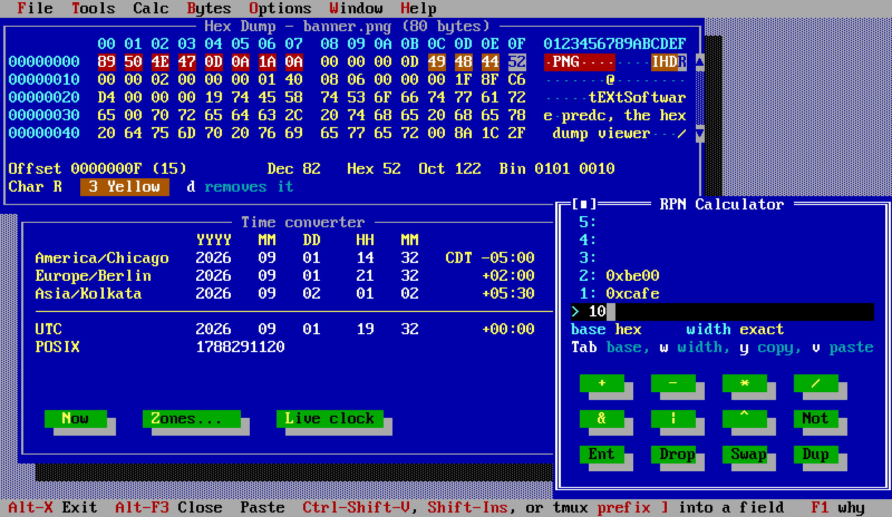

# The Programmer's Every-day Carry

**predc** — the programmer's every-day carry — is a desktop of small tools that a programmer often needs, in
one nostalgic terminal window: an RPN calculator, a hex dump viewer, a time zone
converter, an ASCII chart, base and Unicode encoders, a random value generator,
an environment variable browser, a calendar, and a notepad.



Underneath it is the rest of this repository: [Turbo Vision][tv] — the framework
Borland shipped in 1990, revived for modern Unix and Windows by
[magiblot][tv] — bound to Node, and driven from [Gren][gren] as an
Elm-architecture (TEA) program. Three packages, which anybody can build a terminal
application on, and predc as the big example app..

```sh
npm install -g programmers-edc
predc
```

The npm package is `programmers-edc` and the command is `predc` -- `predc` was
taken on npm by somebody else. Node 20 or newer; on linux-x64 there is a
prebuilt binary in the tarball and nothing is compiled, and everywhere else npm
compiles Turbo Vision at install time, which needs node-gyp's usual C++
toolchain and about a minute. The [releases page][rel] also has a tarball that
needs neither npm nor a compiler.

Or from here:

```sh
git clone --recurse-submodules https://github.com/gilramir/programmers-edc
cd programmers-edc
devbox run predc
```

[rel]: https://github.com/gilramir/programmers-edc/releases

[docs/building.md](docs/building.md) is the whole of building, testing and
running, including doing it without devbox.

[gren]: https://gren-lang.org
[tv]: https://github.com/magiblot/tvision

## The components

| | | |
|---|---|---|
| [`programmers-edc/`](programmers-edc/) | **predc**, the application. Gren, and an ordinary consumer of the package: it depends on gren-tvision through `gren.json`  | npm `programmers-edc` |
| [`gren-tvision/`](gren-tvision/) | the Gren API. `init`, `update`, `subscriptions` and `view : Model -> Ui`; windows, menus, dialogs, widgets and mouse handling described as data. Pure Gren — nothing in it calls into C++ | Gren `gilramir/gren-tvision` |
| [`gren-tvision-runtime/`](gren-tvision-runtime/) | the JavaScript half: takes the UI description off the port, diffs it against the last one, and drives the binding. Also `gren-tui`, and the session recorder a bug report is made of | npm `gren-tvision-runtime` |
| [`tvision-node/`](tvision-node/) | the native add-on. Turbo Vision through Node-API, with the library's blocking `run()` inverted into a `step()` that Node pumps, so timers, promises and I/O keep running — modal dialogs included. Carries the C++ library as a submodule | npm `tvision-node` |

The split is forced: **Gren packages may not declare ports**, so the package can
describe a UI but cannot reach a terminal. The application declares the two
ports and hands them over; the npm runtime takes the description off the port
and drives the binding. See FINDINGS.

`gren-tvision/` is the master copy of a package that also has to exist as a
repository of its own, because a Gren package is a GitHub repository with
semver tags and nothing else.
[`gilramir/gren-tvision`](https://github.com/gilramir/gren-tvision) is an export
of that directory, made by `tools/export-gren-tvision.sh`, and is never edited
there.

And two supporting directories: `tools/` holds the cross-language consistency
checks, the API coverage audit, the parallel pty test runner and the packaging
scripts; `m0-load-test/` is the two-function add-on that proved a Node addon
built here would load at all, developed during out prototyping.

## The documentation

**Using it**

- [Turbo Vision, from Gren](gren-tvision/docs/widgets.md) — the guided tour:
  the programming model, the anatomy of the screen, and every widget, with a
  screenshot of each. Start here to write a program.
- [predc's README](programmers-edc/README.md) — the application: what each tool
  does, its command line, its config file, and how to report a bug with a
  recorded session.
- [Building and running](docs/building.md) — the devbox commands, every example
  and what it demonstrates, and the recipe without devbox.
- [Screenshots](docs/screenshots.md) — the picture above, and predc's desktop
  in each of its three color schemes, generated from the running program.

**How it works**

- [How a Gren program ends up on Turbo Vision](gren-tvision/docs/architecture.md)
  — the four layers, and the event loop problem that shaped them.
- [Driving a C or C++ library from Gren](gren-tvision/docs/native.md) — the same
  problem in general, for a reader with some other library in mind.
- [The clipboard, from a terminal program](gren-tvision/docs/clipboard.md) — why
  a copy reaches the rest of the machine sometimes and not others, and why a
  paste over ssh is the harder half.
- [`tvision-node/README.md`](tvision-node/README.md) — the add-on's own API, what
  it deliberately is not, and the inverted event loop in detail.

**Why it is the way it is**

- [FINDINGS.md](FINDINGS.md) — the running record of what turned out to be true,
  including the things that were not what we expected.
- [The plan of record](gren-tvision/examples/README.md) — what each ported
  example forced into the API, and what was left out.
- [How this got here](docs/history.md) — the milestones, and why the API was
  built by porting.
- [What predc was going to be](docs/predc-plan.md) — the application's original
  feature list, what was dropped, and what was declined.
- [publishing.md](docs/publishing.md) — what shipping a package with a compiled
  library in it costs, and what it does not.
- [releasing.md](docs/releasing.md) — the procedure for the next release: what
  to bump, what to publish, in what order, and what bites.
