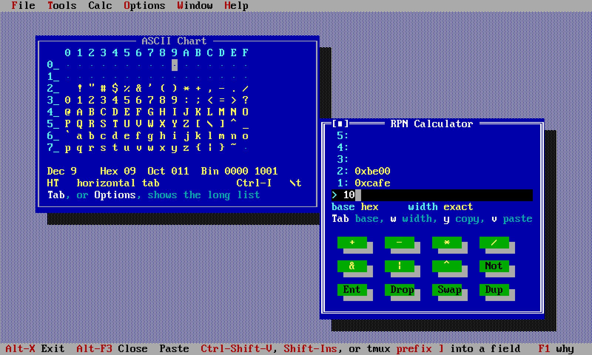
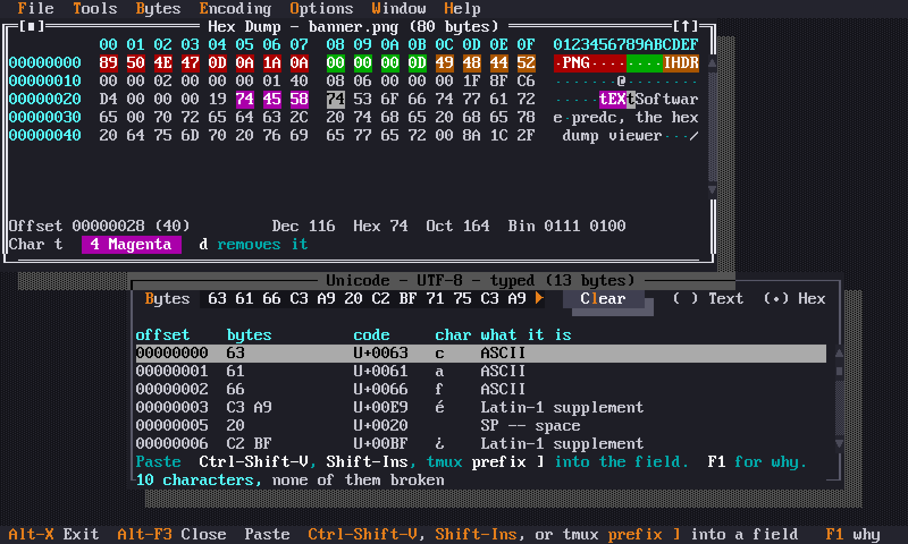
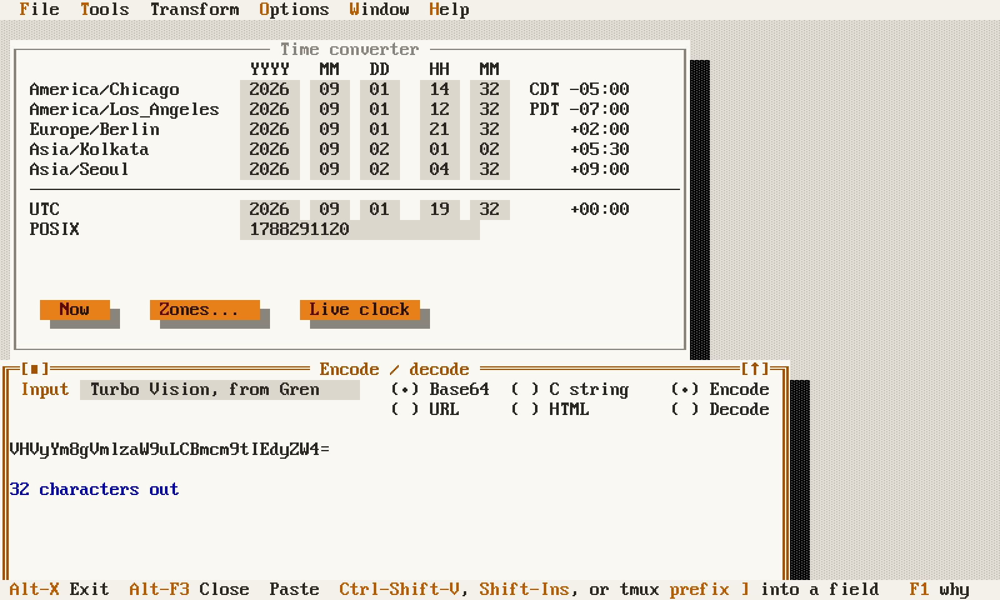

# predc, in its three colour schemes

[predc](../programmers-edc/README.md) is the application this binding exists
for: a desktop of small programmer's tools in one terminal window. Each picture
below is the whole screen, with different tools open and in a different scheme.

All three are generated by [`shots.py`](shots.py), which boots predc at a pty
through the same harness the tests use, keys it into the state described, and
writes a PNG:

```sh
devbox run -- python3 docs/shots.py             # all three, ~45s
devbox run -- python3 docs/shots.py midnight    # just this one
```

They are reproducible byte for byte — the time converter is pinned to a fixed
instant and given a fixed zone list — so a change to the images in a diff is a
change to what predc draws.

The script never reads or writes your own `config.toml`. Each shot runs with
`HOME` set to a temporary directory containing the config file it wants, which
is how the pty drivers under `programmers-edc/test/` isolate themselves too.

## Borland

The scheme predc starts in, and the one Turbo Vision has always looked like.
The ASCII chart on the left, with the cursor on `09` so the lines under the
grid have a control character to name; the RPN calculator on the right, working
in hex.



## Midnight

A dark scheme, built out of 24-bit colour rather than the sixteen. The hex dump
viewer has four ranges of a PNG header painted in four of its six highlight
colours — the signature, the chunk length, the chunk type, and the keyword
inside the text chunk. Below it, the Unicode decoder reading the same kind of
input as bytes.

Those highlight colours come from `Theme.Inks`, not from the palette: a
`Tui.Span` names one of sixteen hues and nothing sits between it and the
terminal. That split is why a scheme here has two halves — see
[the widget documentation](../gren-tvision/docs/widgets.md) for the palette side
of it.



## Gren

A light scheme, in gren-lang.org's paper, slate and orange. The time converter
showing one instant in five zones, and the encoder below it. A light ground is
where a colour scheme is either right or quietly wrong — every colour in this
one was chosen as a contrast ratio against the paper it lands on.


