# Turbo Vision, from Gren

Turbo Vision is Borland's text-mode UI framework from the early 1990s -- the
look of Turbo Pascal and Borland C++: a menu bar along the top, a status line
along the bottom, and overlapping framed windows on a hatched desktop in
between. This package binds [magiblot's modern port][tv] of it, so a Gren
program gets the whole widget set without writing any C++.

[tv]: https://github.com/magiblot/tvision

Most people writing against this have never used Turbo Vision, so this document
is the guided tour: the programming model, the anatomy of the screen, and every
widget in the inventory described from the Gren side. `Tui.gren`'s doc comments
are the reference and are more precise; this is the part that says what the
things *are*.

> Each widget entry ends with the examples that use it, and every picture in
> this document is a photograph of one of them: `doc/shots.py` boots the
> example at a pty, keys it into the state being described, and crops the
> screen to it. So the pictures cannot drift from the code -- and
> [`../examples/`](../examples) is the worked source, every line of which is
> also a pty test.

## The programming model

Turbo Vision in C++ is an object-oriented framework in the strongest sense of
the phrase. You subclass `TWindow`, override `handleEvent`, call `insert()` to
put children in it, override `draw()` to paint, and read state back off the
objects when you need it -- `list->focused`, `checkBox->getData()`. Views own
their state and you go and ask them about it.

Here you do none of that. The program is the Elm architecture:

```gren
view : Model -> Ui
update : Msg -> Model -> { model : Model, command : Cmd Msg }
```

`view` returns a description of everything that should be on screen right now,
and the runtime works out what changed and patches it. Nothing in your program
calls into C++, and nothing in it blocks -- modal dialogs included.

| in Turbo Vision | here |
|---|---|
| subclass `TWindow`, `insert()` children | put a `Window` record in `Ui.windows` |
| `execView(dialog)` blocks until answered | `Tui.dialog` is a `Cmd`; the answer is a `Msg` |
| override `handleEvent` | handle an `Event` in `update` |
| override `draw()` with a `TDrawBuffer` | a `Canvas` of coloured spans, from the model |
| read `list->focused` when you need it | you are *told*, with a `Focused` event |
| `TCalendarView` calls `localtime()` in its constructor | today is a field, and `Time.now` is a task |
| `srand(time(0))` in the puzzle's constructor | the seed is in the model, so the board is a pure function |
| state lives in the view | state lives in the model, and the view is a picture of it |

That last row is the one that keeps coming back. Almost every difference in
this package is the same move applied to a different class: **state that C++
hides inside a view becomes a field in the model, and the field is worth more
than the hiding was.** It is what makes the calendar able to show any month,
the puzzle reproducible from a seed, and a history drop-down something you can
save to a file -- which Borland's, kept in one process-wide buffer behind the
program's back, never could.

There is exactly one exception, and it is deliberate: the `Editor` owns its
document. A file has no business in a message sent on every tick of every
subscription. See its entry below.

## The screen

```
+------------------------------------------------------------+
| File  Edit  Search                                  12:04  |  <- the menu bar, with an
+------------------------------------------------------------+        overlay clock beside it
| ...........................................................|
| ....+- Entries (4) --------------------[^][x]+.............|  <- a window; its rectangle
| ....|                                       #|.............|     is in desktop
| ....|  a list box                           #|.............|     coordinates, where
| ....|                                       #|.............|     y1 = 0 is the row
| ....+----------------------------------------+.............|     under the menu bar
| ...........................................................|
+------------------------------------------------------------+
| Alt-X Exit   Alt-A Add   F3 Edit                           |  <- the status line
+------------------------------------------------------------+
```

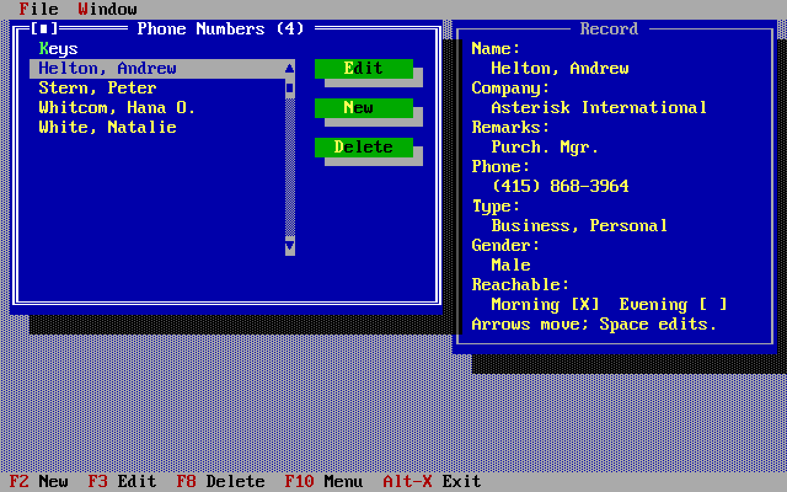

Four regions, and `Ui` has one field for each:

```gren
type alias Ui =
    { menuBar : Array MenuItem
    , statusLine : Array StatusItem
    , windows : Array Window
    , overlays : Array View
    }
```

**Coordinates are the first thing to get wrong.** A `Rect` is `{ x1, y1, x2,
y2 }` in character cells, where `x2,y2` is one past the bottom-right -- so
`{ x1 = 2, y1 = 1, x2 = 30, y2 = 2 }` is a single row 28 columns wide.

  - A **window's** rectangle is in *desktop* coordinates: `y1 = 0` is the row
    under the menu bar, not the top of the screen.
  - A **view's** rectangle is relative to the window that contains it, whose
    frame occupies row and column zero -- so the usable area starts at 1.
  - An **overlay's** rectangle is in *screen* coordinates: row 0 is the menu
    bar's own row, which is where a clock goes.
  - The `Resized` event reports the **desktop's** size, because that is the
    coordinate system windows are written in. It is one row shorter at the top,
    one at the bottom, and the same width as the screen.

`Resized` arrives once at startup and again whenever the terminal changes size,
so nothing has to assume 80x25.

## Ids, and the render cycle

Every window and every view carries an `id`, and **the id is the contract**.
It is what lets the runtime recognise a view across renders and patch it rather
than rebuild it. Keep them stable.

What is patched and what is not:

| change | cost |
|---|---|
| a static text's text, an input line's value, a list's items, a canvas's lines, a cluster's value, a scroll bar's range | patched in place |
| a window's title, a window's rectangle | patched in place |
| a view's id, type or rectangle; a button's command; an input line's `maxLen` or `allowed` | **structural**: the window is closed and rebuilt |
| a window appearing in `Ui.windows` | it opens |
| a window disappearing from `Ui.windows` | it closes |

A rebuilt window loses focus, z-order, scroll position and list highlight, and
a rebuilt `Editor` loses its document. There is no "open a window" command: put
it in the view and it appears.

**Ids also disappear on their own.** When a window closes -- including when the
user closes it from its frame -- everything in it is gone, and you find out
through a `WindowClosed` event. *Handle it*: a model that ignores it will put
the window straight back on the next render.

## The conventions that will surprise you

Turbo Vision predates every UI convention you have. These are not this
package's choices; they are the framework's, and they are worth knowing before
you write a dialog.

  - **`Enter` does not press the focused button**, select a list item, or tick
    a check box. `Space` does all three. `Enter` means "the default action of
    this dialog", and only a button with `isDefault = True` answers it.

    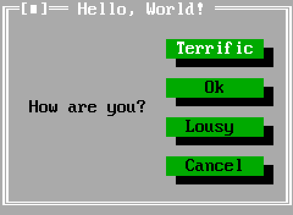

  - **A `~` marks a hotkey**: `"~F~ile"` draws as *F*ile and responds to
    `Alt-F` in a menu, or to the bare letter in a context menu.
  - **Hotkeys are one flat namespace.** Inside a dialog, the first control that
    claims `Alt-`*x* gets it. The status line's keys are *global* and beat even
    an open modal dialog, so a status entry bound to `Alt-N` makes every
    `~N~ame` field in the program unreachable.
  - **The first click on an inactive window is spent activating it** and never
    reaches the control underneath. The same rule applies one level down: a
    control that can take focus and has not got it spends the first click
    taking it. A scroll bar beside a focused canvas therefore needs two clicks,
    which looks exactly like a scroll bar that has stopped working.
  - **The first focusable view in a window's list gets the caret** when the
    window opens. Turbo Vision itself focuses the *last* view inserted, which
    in a list written top to bottom is the Cancel button; this package diverges
    on purpose.
  - **The mouse wheel already works** -- `TScrollBar` has `evMouseWheel` in its
    own event mask -- but it goes to whatever has *focus* rather than to
    whatever is under the pointer, which is Turbo Vision's own rule.
  - **Every window this binding makes has a light grey background**, because
    `JsWindow` derives from `TDialog`. The eight *bright* hues are exactly the
    ones a light background eats: `LightGreen`, `LightRed` and `LightGray` are
    respectively hard to read, hard to read and invisible. Use `Green`, `Red`
    and `DarkGray`.

## The inventory

Thirteen `View` constructors, twelve of them widgets and one a wrapper. Turbo
Vision's own class is named in each heading, so the C++ documentation and
source stay usable. Most of them are in this one dialog:

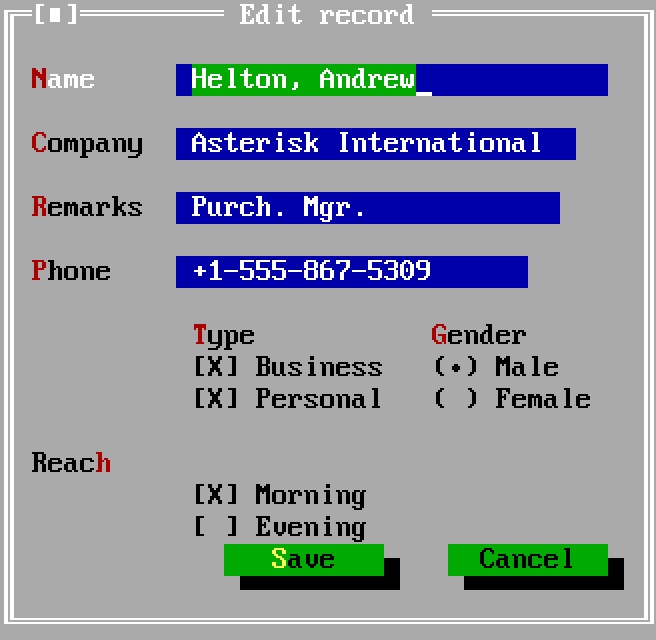

### `StaticText` -- a run of text (`TStaticText`)

```gren
StaticText { id : String, rect : Rect, text : String }
```

The workhorse. It wraps text too wide for its rectangle and silently loses
whatever runs off the bottom, so budget the columns and the rows; a newline in
`text` starts a new one. It takes no focus and reports nothing, and it is the
right answer to a surprising number of things -- a status readout, a label that
names nothing, the line an `Edited` event fills in with `12:4`.

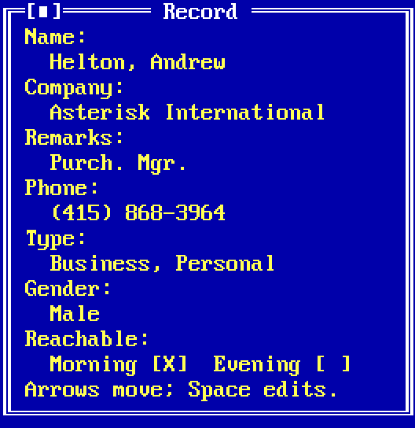

*Used by nearly every example.*

### `Label` -- text bound to a control (`TLabel`)

```gren
Label { id : String, rect : Rect, text : String, for : String }
```

A static text that names another view by id: `Alt-`*x* on the label's hotkey
moves the caret to the control, and clicking the label does too. **List the
control before its label** -- the binding has to have built the view the label
names, and it throws if it has not.

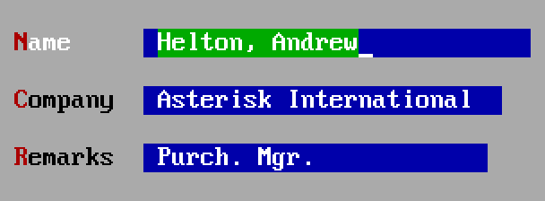

That constraint is the only thing in this package that makes the order of a
window's `views` mean anything beyond who gets focus first.

*Used by `forms`, `entries`, `edit`, `mouse`, `demo`.*

### `Button` -- a push button (`TButton`)

```gren
Button
    { id : String, rect : Rect, title : String, cmd : String
    , isDefault : Bool, takesFocus : Bool
    }
```

Pressing it sends `cmd` as a `Command` event, or closes a `dialog` with it.
Press with `Space`, with a click, or with its `~`*x*~ hotkey; `Enter` reaches
only a button with `isDefault = True`. Twelve columns by two rows is the
conventional size and what the package's own helpers use.


`takesFocus = False` makes a button that can be pressed but never holds the
caret. That is what a keypad or a toolbar wants when something else in the
window is reading the keyboard: `TCalculator` clears `ofSelectable` on all
twenty of its buttons, because otherwise typing `7` would move the caret to the
button captioned 7 instead of entering a digit.

**Inside a modal dialog, only four command names close it**: `"ok"`,
`"cancel"`, `"yes"` and `"no"`. Any other name leaves the dialog up. In an
ordinary window a button's command is whatever you like.

*Used by `hello`, `calc`, `forms`, `edit`, `mouse`, `palette`, `entries`,
`demo`.*

### `InputLine` -- a text field (`TInputLine`)

```gren
InputLine
    { id : String, rect : Rect, maxLen : Int
    , value : String, allowed : Maybe String
    }
```

One line of editable text, with the usual editing keys and a selection.

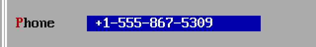

`maxLen` is how many characters it will hold; the field scrolls sideways when
the text outgrows the rectangle.

`value` is written into the field **only when it changes in the model**, so it
never overwrites what somebody is typing. Every edit arrives as a `Changed`
event carrying `Text`, collapsed so that typing a word is one event rather than
one per letter.

`allowed` is the set of characters the field will accept, as a string:
`Just "0123456789"` is a digits-only field, and `Nothing` -- almost always what
you want -- accepts anything. A rejected keystroke does not happen, so nothing
is reported and there is nothing for the model to do about it. It filters
*typing* and only typing: a `value` the model sets goes in whatever it
contains, because the model put it there and validating what the model produced
is the model's job.

This is where Turbo Vision's `TValidator` family went. `TFilterValidator`'s
filtering half is `allowed`; its checking half raises a message box from inside
the dialog, which is a nested event loop, and is overridden away.
`TRangeValidator` is `allowed = Just "+-0123456789"` plus one `String.toInt` in
`update`, which produces an error message the program wrote rather than
Borland's in a box the model cannot see.

*Used by `forms`, `entries`, `edit`.*

### `History` -- the drop-down beside a field (`THistory`)

```gren
History { id : String, for : String, items : Array String }
```

The `▼` button Turbo Vision puts to the right of an input line, holding what
was typed there before. Clicking it -- or pressing `Down` in the field -- opens
a list; choosing an entry puts it in the field and arrives as an ordinary
`Changed` event *on the field*, because that is what happened.

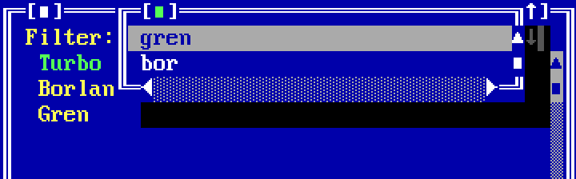

Two things about it are unusual:

  - **It has no rectangle.** It occupies the three columns immediately to the
    right of the field it names, which is where every Turbo Vision dialog puts
    one. Leave three columns, and **list the field before its history**.
  - **The model owns the list.** Turbo Vision keeps histories in one
    process-wide buffer keyed by a hand-picked number, silently dropping the
    oldest when it fills, written to behind your back when a field loses focus.
    None of that is used here: `items` arrives with the render like a list box's
    does, and nothing is remembered until the model decides to remember it --
    usually one `Array.pushFirst` when a dialog is answered. Which also means
    it can be saved to a file.

*Used by `entries`, and by `Tui.fileDialog` under the fixed id
`"fileHistory"`.*

### `ListBox` -- a scrolling list (`TListBox` / `TListViewer`)

```gren
ListBox { id : String, rect : Rect, items : Array String, focused : Int }
```

The most-used control in Turbo Vision, and the one with two states worth
distinguishing:

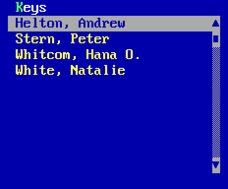

  - the **highlight** moves with the arrow keys, the mouse or a render, and
    reports a `Focused` event;
  - a **selection** is committed with `Space` or a double click, and reports a
    `Selected` event.

`focused` is the highlight seen from the other side: written to the list only
when the *model* changes it, so it steers without fighting the arrow keys. Both
halves are load-bearing when a list is a cursor over a sorted collection --
rename a record and it moves, and the model needs the last word about where the
highlight lands.

It gets **a scroll bar of its own, in the single column immediately to the
right of its rectangle**, so leave one. Turbo Vision puts a list's bar on the
window frame instead, which is right for a window that is a list and nothing
else and wrong for anything with two panes in it.

There is no tree widget, and none is needed. `TOutlineViewer` exists in C++
because the view has to own the node chain and work out which rows are visible;
a model that re-renders owns the structure already, so a tree is a `type Node`
in the model, the visible rows are a fold over it, and a plain `ListBox`
displays them with its scrolling and its highlight. `examples/dir` is that:

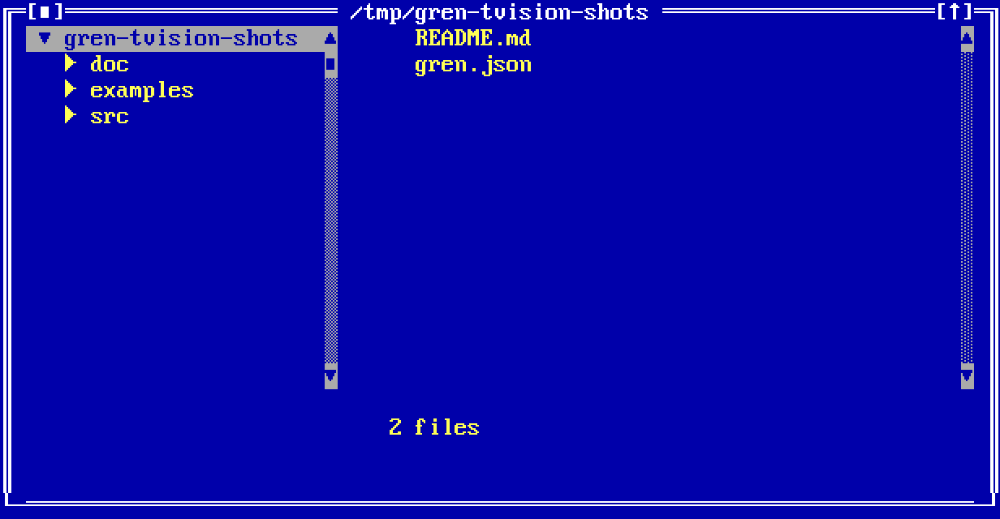

*Used by `entries`, `forms`, `dir`.*

### `CheckBoxes` -- a cluster of tick boxes (`TCheckBoxes`)

```gren
CheckBoxes { id : String, rect : Rect, items : Array String, checked : Array Bool }
```

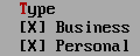

A *group*, not a single box: Turbo Vision clusters check boxes so that arrow
keys move within the group and one hotkey per item reaches its box directly.
`Space` ticks the focused one. `checked` is one flag per item, and like an
input line's `value` it is written to the screen only when the model changes
it.

The user's ticks arrive as a `Changed` event carrying `Flags`, and are also
collected in a dialog's answer, where `Tui.flags` reads the whole group and
`Tui.flag` reads one box by index.

*Used by `forms`, `edit`.*

### `MultiCheckBoxes` -- boxes with more than two states (`TMultiCheckBoxes`)

```gren
MultiCheckBoxes
    { id : String, rect : Rect, items : Array String
    , marks : String, states : Array Int
    }
```


The same cluster, where each box cycles through several states rather than two.
`marks` is one character per state, in order, drawn between the brackets:
`" ?X"` is a box that goes blank, `?`, `X` and wraps. `states` is one index into
`marks` per item.

Turbo Vision packs *every* box's state into one 32-bit word, so
*items* x *bits per state* has to fit in 32 -- eight boxes of four states,
sixteen of three. The binding says so with both numbers in the message rather
than letting the shift quietly drop the boxes that do not fit.

Reported as a `Changed` event carrying `Marks`, and read out of a dialog with
`Tui.marks`.

*Used by `forms`.*

### `RadioButtons` -- one of several (`TRadioButtons`)

```gren
RadioButtons { id : String, rect : Rect, items : Array String, selected : Int }
```

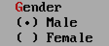

The same cluster machinery with exactly one item chosen; `selected` is its
index. `Space` or a click chooses the focused one, arrow keys move within the
group, and each item can have its own `~`*x*~ hotkey. Reported as `Changed`
carrying `Choice`, and read from a dialog with `Tui.number`.

A colour scheme picker, a units selector, a "sort by" -- in Turbo Vision this
is also what a settings dialog is made of, and `examples/demo` uses five of
them where the C++ original has an entire `TColorDialog` family.

*Used by `forms`, `demo`.*

### `ScrollBar` -- a scroll bar the model owns (`TScrollBar`)

```gren
ScrollBar
    { id : String, rect : Rect, value : Int
    , min : Int, max : Int, pageStep : Int, arrowStep : Int
    }
```

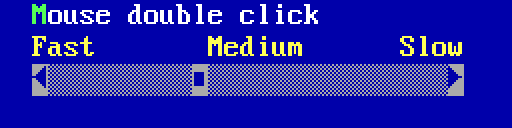

A list box makes its own; this is one you put in a window and ask about. Moving
it -- arrow, page, drag, wheel or key -- sends a `Scrolled` event, and `value`
written back from the model moves it.

**Which way it points is not a field.** `TScrollBar` decides from its own
rectangle: one column wide is vertical, one row tall is horizontal. A second
way to say the same thing would only be a way for the two to disagree.

A drag reports only where it *ended*; the intermediate positions are collapsed,
because a model that re-rendered on each of them would redraw the window a
dozen times per gesture.

Two things inherited from magiblot's port: **it does not page on a click** --
Borland's steps by `pageStep` when you click past the thumb, this one takes the
thumb to the pointer -- so `pageStep` is reached only from the keyboard, and on
a horizontal bar that is `Ctrl-Left` and `Ctrl-Right`.

When both the model and the user can move the same bar, the rule has to live in
the model, because it is the only place that knows both numbers.
`examples/watch` uses the one every log viewer arrives at: follow the bottom
until the user leaves it, follow again when they come back.

*Used by `mouse`, `viewer`, `dir`, `watch`.*

### `Canvas` -- paint it yourself (the `TView` you would have subclassed)

```gren
Canvas
    { id : String, rect : Rect
    , lines : Array (Array Span)
    , cursor : Maybe { x : Int, y : Int }
    , takesFocus : Bool
    }
```

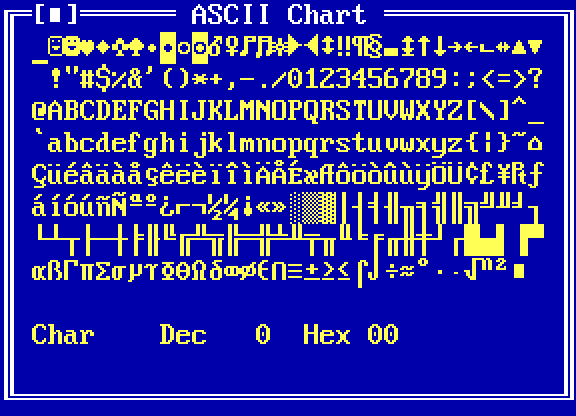

The escape hatch, and where a C++ program would have subclassed `TView` and
overridden `draw()`. It paints exactly the lines it is given and reports
`KeyPressed` and `Clicked` while focused. Turbo Vision's own calendar, ASCII
chart, puzzle and calculator display are all views of this kind, and so is
every scrolling output pane here -- `TTerminal` and `TScroller` went the same
way `TOutline` did, because deciding which slice to draw is something the model
already knows.

A line is an array of `Span`s:

```gren
type alias Span = { text : String, fg : Maybe Hue, bg : Maybe Hue }

line  : String -> Array Span   -- a whole row in the window's own colour
plain : String -> Span
ink   : Hue -> String -> Span  -- a foreground, on whatever is behind it
on    : Hue -> Span -> Span    -- ...and a background too
```

`Nothing` for either half means the colour the window's palette gives this view,
which is what you want almost everywhere -- it is how a canvas goes on looking
like the rest of the program. Name a colour only where the point *is* the
colour: today on a calendar, a tile that is out of place, a job that failed.
`Hue` is the sixteen colours a terminal has had since 1981, which is also all
that Turbo Vision's palettes deal in.

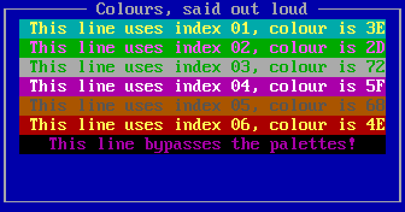

`cursor` is the terminal's own block cursor in the canvas's coordinates -- the
one piece of a canvas that is not made of characters, and the only way an ASCII
chart can show which cell is selected. `Nothing` hides it.

`takesFocus` matters more here than on a button: **a focused canvas consumes
every key it receives, `Tab` included**, so a canvas that is only there to be
looked at or clicked should say `False` or it will trap the caret. Clicks still
arrive either way.

*Used by `ascii`, `calendar`, `puzzle`, `calc`, `mouse`, `viewer`, `dir`,
`watch`, `demo`, `palette`.*

### `Editor` -- a text editor (`TEditor`)

```gren
Editor { id : String, rect : Rect }
```

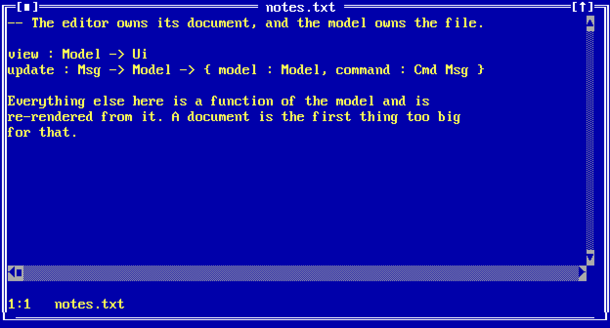

`TEditor` is Borland's editor: insert and overwrite, selection, one level of
undo, a clipboard shared between editors, auto indent, word-left and word-right,
and the block and line commands from Borland's keymap. All of it works here. It
gets scroll bars of its own, in the column to the **right** and the row
**below** its rectangle, so leave one of each.

**It is the one view with no contents in it**, and that is the whole design.
Everything else here is a function of the model and is re-rendered from it; a
document is the first thing too big for that, because `view` runs on every tick
of every subscription and a file has no business in a render message.

So the editor owns the buffer and the model owns the *file*:

| | |
|---|---|
| `Tui.setEditorText tui "body" text` | put a document in |
| `Tui.readEditor tui "body"` | ask for it back; answered by an `EditorText` event |
| `Edited { isModified, line, column }` | what arrives in between, on every keystroke |
| `Tui.findInEditor` / `Tui.replaceInEditor` | search; answered by a `Searched` event |

Three numbers per keystroke instead of a file. A status line saying `12:4` and a
Save that lights up when there is something to save are what a program wants on
every edit; the document crosses twice per file.

The commands `"clipboard.cut"`, `"clipboard.copy"`, `"clipboard.paste"`,
`"editor.clear"`, `"editor.undo"` and `"editor.selectAll"` are built in -- put
one on a menu and it reaches whichever view has the caret without passing
through `update` at all. There is deliberately no `"editor.save"` and no
`"editor.find"`: writing a file is a `Task` and searching needs a string, and
both are things only the model can produce.

**The first three are not the editor's.** `TInputLine` reacts to `cmCut`,
`cmCopy` and `cmPaste` exactly as `TEditor` does, so those three names act on
whichever of the two holds the caret -- which is why they carry a different
prefix. `doc/clipboard.md` has what they share underneath and why it took a
while to notice.

**One sharp edge, and it is the price of a view whose contents are not in the
view: give it a fixed rectangle and let `Grows` resize it.** A rectangle is
structural, so changing one rebuilds the window -- and a rebuilt editor is an
*empty* one, because there was never a copy of the document in the render to
put back. A rectangle computed from `Resized` will throw the document away the
first time the terminal changes size. The window's own rectangle is safe: that
one is patched.

*Used by `edit`.*

### `Grows` -- which edges follow the window (`growMode`)

```gren
Grows { grow : Grow, view : View }
```

Not a widget: a wrapper that says which of a view's four edges move when its
window is zoomed, resized, tiled, or carried along by a terminal that changed
size. Without it a view keeps the rectangle the model gave it, so a window that
got taller shows the same list box with empty space underneath.

The same window in an 80x25 terminal and in a 100x30 one: the list stretched,
the caption stayed a row above the button, and the button stayed at the foot.

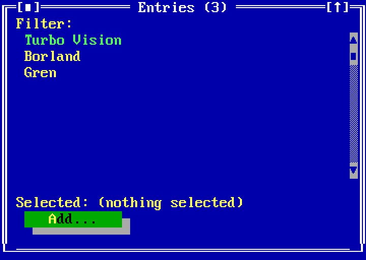
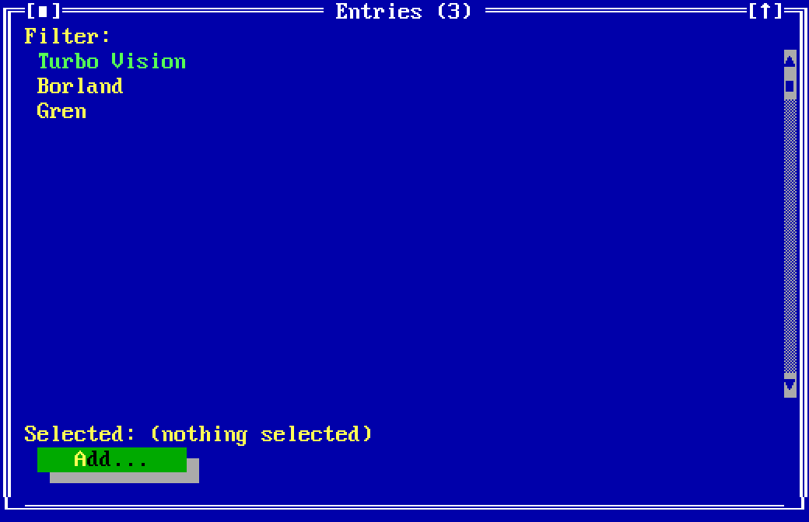

It is Turbo Vision's own `growMode`, one flag per edge, resolved by
`TGroup::changeBounds`. The interesting combinations are pairs, and they are
named:

| | |
|---|---|
| `Tui.fixed` | nothing follows -- the default, and rarely written |
| `Tui.stretch` | right and bottom: the view grows, keeping its top-left corner |
| `Tui.stretchWidth` / `Tui.stretchHeight` | one axis of the same |
| `Tui.pinRight` | both horizontal edges: keeps its size, stays the same distance from the right |
| `Tui.pinBottom` | both vertical edges: a row of buttons that stays at the foot of the window |

```gren
Grows
    { grow = Tui.stretch
    , view = ListBox { id = "entries", rect = ..., items = ..., focused = 0 }
    }
```

It is opt-in because most views do not want it, and a wrapper rather than a
field on all twelve records so that a view that does not care says nothing at
all. Wrapping a wrapper is legal and the outer one wins.

*Used by `entries`, `edit`, `demo`.*

## Windows, dialogs and chrome

### `Window`

```gren
type alias Window =
    { id : String, title : String, rect : Rect, views : Array View }
```

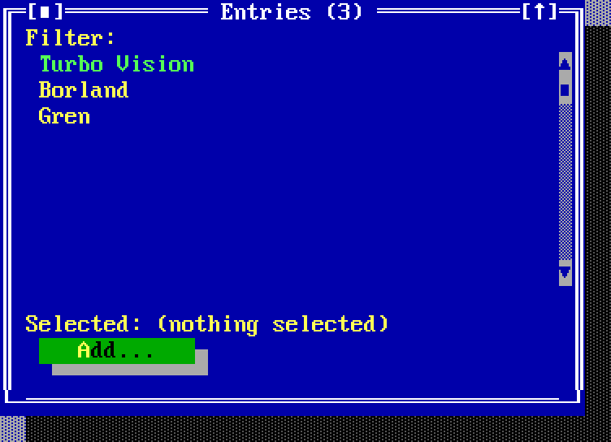

A framed, movable window on the desktop, with a close box and a zoom box. The
frame occupies row and column zero, so a view's rectangle starts at 1. Windows
can be zoomed, resized, tiled and cascaded -- `"tile"` and `"cascade"` are
built-in command names and `examples/demo` puts them on a menu:

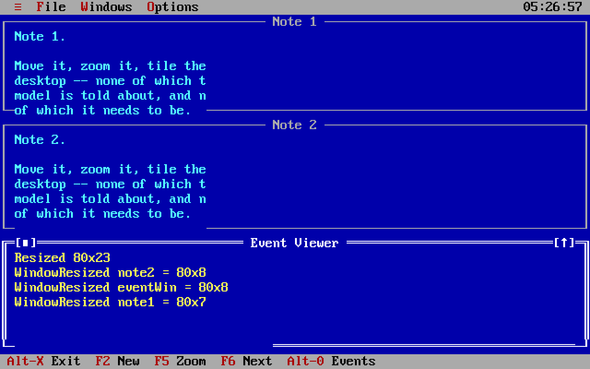

`title` and `rect` are both patched in place, so a counter in a title
(`Entries (3)` becoming `Entries (4)`) and a window that lays itself out against
the terminal size are both ordinary model changes.

### Dialogs (`TDialog`, without `execView`)

```gren
Tui.dialog tui { id = "add", title = "Add entry", rect = ..., views = [ ... ] }
```

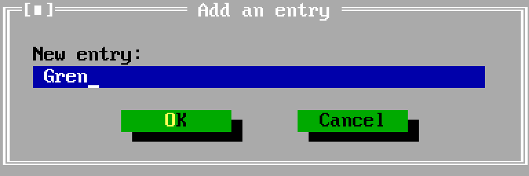

A `DialogSpec` is the same shape as a `Window`, plus the fact that it is
*answered* rather than merely shown. `Tui.dialog` is a `Cmd`; the answer arrives
as a `DialogClosed` event carrying the `id`, the `cmd` of the button that closed
it, and `values` -- every field in the dialog, read out with `Tui.text`,
`Tui.number`, `Tui.flag`, `Tui.flags` and `Tui.marks`.

**Modal means input goes to this dialog and nowhere else. It does not mean
anything stops.** Subscriptions keep firing, tasks keep running, and the clock
behind the dialog keeps ticking -- which is not how Turbo Vision does it, and is
most of what the binding had to build. A dialog opened from a dialog is
ordinary.

Two rules to remember: only `"ok"`, `"cancel"`, `"yes"` and `"no"` close a
modal, so a dialog gets at most four buttons; and closing one from its frame or
with `Esc` reports `"cancel"` whether or not there is a Cancel button.

A dialog is *not* part of `view`, so nothing patches one while it is up.
"Navigate into a directory" is therefore an answer like any other: list the new
path in `update` and open another dialog.

### The menu bar (`TMenuBar`, `TSubMenu`, `TMenuItem`)

```gren
menuBar =
    [ SubMenu
        { title = "~F~ile", key = ""
        , items =
            [ Item { title = "~O~pen", cmd = "open", key = "F3", shortcut = "F3" }
            , Separator
            , Item { title = "E~x~it", cmd = "quit", key = "Alt-X", shortcut = "Alt-X" }
            ]
        }
    ]
```

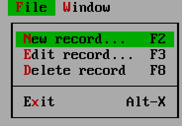

`key` is a hotkey that works anywhere; `shortcut` is the hint drawn
right-aligned in the pull-down and is text only. `SubMenu` nests to any depth.
An entry on the *bar* with no items of its own is a plain command sitting on the
bar, which is what `tvision/examples/mmenu` does with its "Next menu":


**The menu bar is part of the view.** Turbo Vision builds it inside the
application constructor, which makes it look like fixed configuration, but both
`TMenuView` and `TStatusLine` keep their contents in members a subclass can
swap -- so `menuBar` lives in `Ui` next to the windows and
`menuBar = menuBarFor model.current` is an ordinary model change. The C++
original of that spends 124 lines across three files.

**One known limitation, and it is the menu bar's rather than this package's**:
`TMenuView::execute` runs an event loop of its own, so for as long as a
pull-down is open the program is stopped -- no timers, no subscriptions, no
renders. Nothing is lost (a `Time.every` that should have fired arrives when the
menu closes) and a menu is open for a second at a time. It is why `popupMenu` is
not built on Turbo Vision's own machinery.

### The status line (`TStatusLine`)

```gren
statusLine = [ { text = "~Alt-X~ Exit", key = "Alt-X", cmd = "quit" } ]
```


The bar along the bottom. Every entry is clickable, and **its `key` works
everywhere, including over an open modal dialog** -- Turbo Vision offers the
status line every keystroke before anything else sees it. Choose them carefully.
An entry with an empty `cmd` is a hint: drawn, not clickable.

Like the menu bar it is part of `Ui` and can change with the model. It is
replaced whole rather than patched, which is cheap for a line of text and is
why a clock does not belong in it.

### Context menus (`TMenuBox`, as a popup)

```gren
Tui.popupMenu tui
    { view = click.id
    , at = { x = click.x, y = click.y }
    , items =
        [ Entry { title = "Cu~t~", cmd = "cut", shortcut = "Shift-Del" }
        , Divider
        , Entry { title = "~D~elete", cmd = "delete", shortcut = "" }
        ]
    }
```

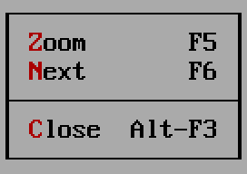

`view` and `at` are exactly what a `Clicked` event hands you, so opening a menu
where the user clicked needs no arithmetic; the menu flips up or left if there
is no room below or right. **What comes back is an ordinary `Command` event** --
indistinguishable from the same command on the menu bar, which is the point --
and choosing nothing sends nothing at all. An entry whose command has been
greyed out with `setEnabled` is drawn greyed and cannot be chosen.

**A context menu is flat**: `PopupItem` is `Entry` and `Divider`, and there is
no `SubMenu`. That is a decision, not an omission -- a submenu is a nested event
loop, and this menu is driven by the same pump as everything else, which is what
lets the program keep running while it is up. `TEditor`'s own context menu (Cut,
Copy, Paste, Undo) is flat too.

### Overlays (`TClockView`, `THeapView`)

`Ui.overlays` holds views on the **application** rather than on the desktop.
Turbo Vision inserts a clock into `TProgram`, not into `TDeskTop`, and that is
not an implementation detail: the desktop is the patterned area windows live in,
and a clock in the top-right corner is not in it.

An overlay is drawn above every window, cannot be covered by one, never takes
part in Tile or Cascade, and is in **screen** coordinates -- row 0 is the menu
bar's row.

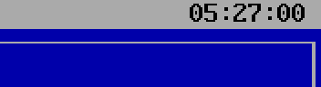

```gren
overlays =
    [ Grows
        { grow = Tui.pinRight
        , view = StaticText { id = "clock", rect = ..., text = clock model.now }
        }
    ]
```

The set is patched by id exactly as a window's contents are, which is what lets
a clock render once a second without repainting the corner every time. Overlays
are for showing things; put anything the user has to reach in a window.

A `StaticText` here draws in `theme.bar` -- the menu bar and status line's own
colour, which is what `TClockView` uses. There is no panel behind a view on the
application to take a colour from, and row 0 is the bar's row, so matching it
is the only thing that looks deliberate.

*Used by `demo`.*

## What the package builds for you

Two helpers that are ordinary Gren rather than new kinds of thing. Both return a
`DialogSpec` you hand to `Tui.dialog` like any other, and both take `desktop`
-- the size the model was last told by `Resized` -- because a dialog's rectangle
is in desktop coordinates and a centred box has to know.

### `Tui.messageBox`

```gren
Tui.dialog tui <|
    Tui.messageBox
        { id = "confirm"
        , title = "Delete"
        , text = "Delete \"" ++ name ++ "\"?\nThis cannot be undone."
        , buttons = Tui.yesNoButtons
        , desktop = model.desktop
        }
```

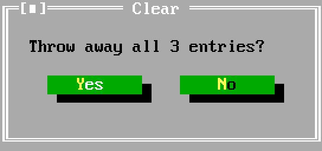

Sized to its longest line. `okButtons`, `okCancelButtons`, `yesNoButtons` and
`yesNoCancelButtons` cover the four Turbo Vision uses -- and those four command
names are the only ones that close a modal, so use them. Turbo Vision's own
`messageBox()` is a function in the library because it calls `execView`; here it
is fifteen lines of dialog that every program would otherwise write for itself.

Closing a box from its frame or with `Esc` reports `"cancel"` even when it has
no Cancel button, so a Yes/No box has three answers to handle rather than two.

### `Tui.fileDialog`

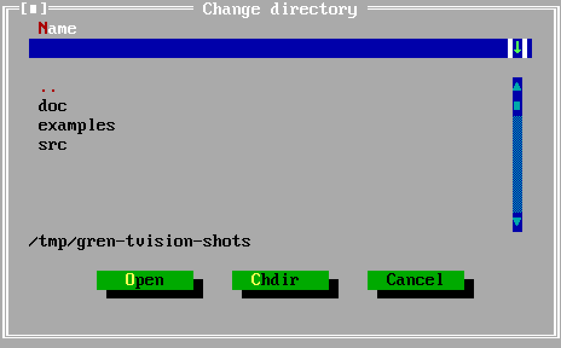

A file or directory chooser: a field with a history drop-down, a list, a path
line and your buttons. It is a *layout* and nothing else. `TFileDialog` reads
the directory from inside itself; here listing a directory is a `Task`, so the
model reads and hands over what it found, and what the entries say, whether
`".."` is among them and what a name means are the program's business.

Three ids in it are fixed rather than derived, because only one modal can be
open at a time: `"fileName"` (read with `Tui.text`), `"fileList"` (read with
`Tui.number` -- an index into the `entries` you passed in, so look it up there
rather than parsing the text back), and `"fileHistory"`. Do not give a view in
an open window any of the three.

## Commands, and the names you may not use

A command is a string. Most of them arrive in `update` as a `Command` event;
some are handled by Turbo Vision itself and never reach you at all:

| name | what Turbo Vision does with it |
|---|---|
| `quit`, `close`, `zoom`, `resize`, `next`, `prev`, `menu`, `help` | window and application management |
| `ok`, `cancel`, `yes`, `no` | close a modal dialog |
| `tile`, `cascade` | arrange the desktop |
| `clipboard.cut`, `clipboard.copy`, `clipboard.paste` | reach whichever `Editor` **or `InputLine`** has the caret |
| `editor.clear`, `editor.undo`, `editor.selectAll` | reach whichever `Editor` has the caret |

**That list is also a set of names your program may not use for anything
else.** Calling a command `"cancel"` because there is a Cancel entry on your
menu gets an entry that draws, a hotkey that works, and no event ever -- Turbo
Vision took it, and outside a dialog `cmCancel` does nothing at all. Nothing
reports this; pick another name. The editor's six are the only prefixed names,
and the prefix is the point: an editor's vocabulary is made of the most ordinary
words a menu can contain, and two examples here had had a Clear of their own
for months.

Four commands the model can issue that are not about drawing:

  - **`Tui.setEnabled tui "clear" (Array.length model.items > 0)`** greys a
    command out everywhere it appears -- menu entries, status entries and
    buttons alike -- and a disabled command cannot be triggered by any route,
    hotkey included. (Only the first 146 distinct command names in a program
    can be disabled; beyond that they are numbered above the range Turbo Vision
    allows to be greyed.)

    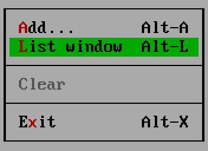

  - **`Tui.focus tui "list"`** puts the caret on a view, or raises a window. The
    id is looked up as a window first and then as a view. This is how a program
    answers "show me that window" for a window that is already open and buried,
    or puts the caret back in the field an error was about.
  - **`Tui.setDoubleClickDelay tui 8`** in PC timer ticks, 1/18.2 of a second,
    because that is what `TEventQueue::doubleDelay` has always counted in.
  - **`Tui.quit tui`** cancels any open dialog, restores the terminal and exits.

## What the model is told

| event | when |
|---|---|
| `Command String` | a menu entry, status entry, button or context-menu entry |
| `Selected { id, index, text }` | a list entry was committed (`Space`, double click) |
| `Focused { id, index, text }` | a list highlight moved, by key, mouse or render |
| `KeyPressed { id, key }` | a key reached a focused canvas -- `"Left"`, `"F5"`, `"Alt-X"`, `"a"` |
| `Clicked { id, x, y, isDouble, isRight }` | a canvas was clicked, in its own coordinates |
| `Scrolled { id, value }` | a scroll bar moved; a drag reports where it ended |
| `Resized { cols, rows }` | how big the desktop is: once at startup, then on every change |
| `Changed { id, value }` | the *user* moved a value: `Text`, `Flags`, `Choice` or `Marks` |
| `Edited { id, isModified, line, column }` | an editor was edited or its caret moved |
| `EditorText { id, text }` | the answer to `readEditor` -- the only event carrying a document |
| `Searched { id, matches }` | the answer to `findInEditor` / `replaceInEditor`; `0` is "not found" |
| `DialogClosed { id, cmd, values }` | a dialog was answered |
| `WindowClosed String` | the user closed a window from its frame. **Handle it** |
| `Unknown String` | an event this version of the package does not understand |

Two things follow from this table being the whole list. **Nothing Turbo Vision
handles itself is reported** -- moving a window, opening a menu, pressing
`Tab` -- which is the bargain that makes the model small. And **`Changed` is not
sent for a value the model set itself**: only a change the model did not already
know about is news.

## What Turbo Vision has that this does not, and why

Every `TView` subclass in the library has been walked against the binding. The
stock controls are all here. These were left out, each with a reason:

| class | why not |
|---|---|
| `TOutlineViewer`, `TOutline` | a tree is a model plus a fold plus a `ListBox` -- see `examples/dir` |
| `TScroller` | what a scroller does is decide which slice to draw, and the model knows |
| `TTerminal`, `TTextDevice` | the same, for scrolling output: a canvas and a model -- see `examples/watch` |
| the three levels of palette indirection | a `Span` names its colour outright; `examples/palette` argues what that costs |
| `TColorDialog` and its five helpers | an editor for that indirection. A colour dialog here is a form, and what it sets is a field |
| `TValidator`'s other four subclasses | `allowed` plus one branch in `update`; the rest is a message box inside a nested loop |
| `TFileEditor` | `TEditor` plus loading and saving, which are `Task`s. Only its growing buffer was wanted, and `JsEditor` has that |
| `TEditWindow`, `TIndicator` | a window is already a value, and the indicator is a `StaticText` fed by the `Edited` event |
| `TMemo` | the honest version is an `Editor` in a dialog plus a `readEditor` before it closes; putting a document in every `DialogClosed` is not worth it |
| `TParamText` | `printf` for a static text. String interpolation is the model's job by construction |
| the `TCollection` family, `opstream`/`ipstream` | serialising views to disk has no Gren meaning |
| `THelpFile` and `tvhc` | a binary help format compiled by a separate tool. Help screens are windows |

## Where to go next

  - [`Tui.gren`](../src/Tui.gren) -- the API reference, in doc comments.
  - [`../examples/README.md`](../examples/README.md) -- the plan of record: what
    every port forced into the API, and why each decision went the way it did.
  - [architecture.md](architecture.md) -- how the four layers fit together, and
    the event loop that shaped them.
  - [`../../FINDINGS.md`](../../FINDINGS.md) -- the long version of everything
    above.
