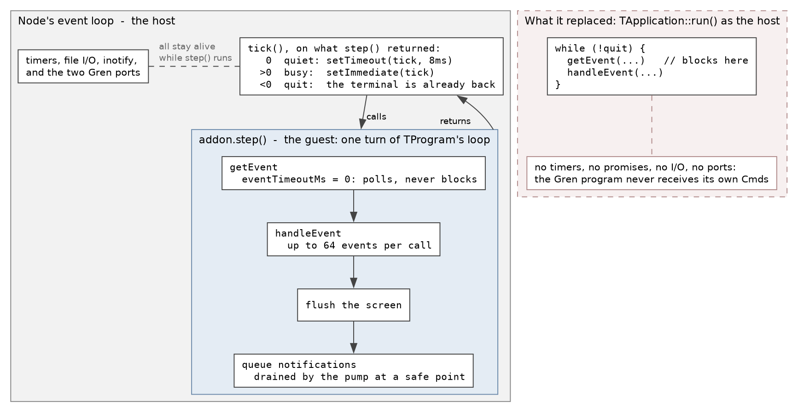

# How a Gren program ends up on Turbo Vision

This is the technical half of the documentation. It explains what the layers
are, why there are four of them, what Turbo Vision forced into the design, and
why having the event loop decided most of it. Nothing here is needed to write a
program; for that, read [widgets.md](widgets.md). For the general problem of
using a C or C++ library from Gren, of which this binding is one instance,
read [native.md](native.md).

## The four layers

```
Tui.gren                    pure Gren: types, encoders, decoders, defineProgram
   |  JSON over two ports (out: render and commands, in: events)
   v
gren-tvision (npm)          tui.js  -- reads the port, routes messages
                            diff.js -- one UI description -> calls on the binding
   |  ordinary JavaScript calls
   v
tvision-node (npm)          index.js -- the pump
                            src/*.cc -- N-API addon: widgets, ids, modality
   |  C++
   v
libtvision.a                magiblot/tvision, built PIC inside devbox
```

These are three published artifacts, and the split is forced rather than chosen:

| artifact | registry | contents |
|---|---|---|
| `gilramir/gren-tvision` | Gren | pure Gren: types, encoders, `defineProgram` |
| `gren-tvision` | npm | the diff layer and the `gren-tui` launcher |
| `tvision-node` | npm | the native binding |

In this repository they are the directories `gren-tvision/`,
`gren-tvision-runtime/` and `tvision-node/`. The middle one publishes as the
npm package `gren-tvision`, which is why its name and its directory differ.

The split is forced because a Gren package may not declare ports. The compiler
refuses outright, with a rationale inherited from Elm about keeping the package
ecosystem free of JavaScript. So the package can describe a UI but cannot
reach a terminal. The application declares the two ports, `tuiOut` and
`tuiIn`, and hands them to `Tui.defineProgram` as a `Tui.Ports msg` record.
That is eight lines of boilerplate per program and there is no way around it.

The compile step matters for the same reason. `gren make Main` produces a
self-running script with no handle to attach ports to. `gren make Main
--output=main.js` produces a CommonJS module that runs nothing and exports
`Gren.Main.init`. The `gren-tui` launcher requires that module, calls
`init({flags})`, subscribes to `tuiOut` and sends on `tuiIn`. Commands issued
from the program's `init` arrive after `init()` returns, so subscribing
afterwards misses nothing. There is no wrapper, no source rewriting and no
kernel code.

## What Turbo Vision forced into the design

Gren has no FFI. The only door out of a Gren program is a port, which carries
JSON in one direction, asynchronously, with no return value. Data comes back
the same way and never as a reply: JavaScript sends JSON on a second port, and
the program hears it as an ordinary `msg` in `update`, unconnected to whatever
it sent out. Everything in this section follows from that.

### Nothing can be asked, only told

The C++ `tvforms` example reads `list->focused` at the moment its Edit button
is pressed. A Gren program cannot, because there is no call to make and no
value to come back. So every piece of state a C++ program would have queried
became something the model is told: `Focused` when a list highlight moves,
`Changed` when the user moves a value, `Resized` when the terminal changes
size. Each of those was a protocol version, and each replaced what would have
been the first synchronous question in the protocol.

### Anything that must be asked becomes two steps

When an answer really does have to come back, the shape is a `Cmd` that
produces a `Msg`, like an HTTP request. The examples do this four times:
`dir`'s Change Dir lists the directory and then shows it; `edit`'s Save reads
the document and then writes it; `entries`' Clear asks and then throws away;
`edit`'s Find asks for the string and then searches. The rule is the same each
time. When a command needs something only the model can produce, the model
handles it and answers with a `Cmd` of its own. Built-in command names are for
the commands that need nothing.

### Turbo Vision keeps state in objects; a Gren view is a description

A `TWindow` has focus, a z-order, a scroll position and a caret, and none of
them appear in the model. Rebuilding the UI from the description on every
update would throw all of that away. So the description is diffed against the
previous one, which is the same bargain `elm/browser` makes with the DOM. That
is what `diff.js` does, and it is why every window and every view carries an
`id`: the id is the identity that survives a render.

### Object lifetimes do not respect immutable descriptions

Turbo Vision destroys a window's children with the window, and the user can
close a window from its frame without telling anybody. `JsWindow::~JsWindow`
is the one place every path passes through, so it drops the window and every
id in it, and `exists()` is an ordinary thing to call. The first version
dispatched the close notification from inside that destructor, which handed
JavaScript a half-destroyed window that the declarative layer promptly closed a
second time. Notifications are now queued and drained at a safe point. That
fix broke its own suppression flag in an instructive way: a synchronous flag is
useless for an asynchronous notification, so `diff.js` keeps a set of the ids
it closed itself.

### The C++ side has constraints of its own

  - `TProgInit` calls `initMenuBar` and `initStatusLine` from inside the
    `TApplication` constructor. They are static functions with no user-data
    channel, so the description has to be parked in a global before the
    application is constructed. Together with `TProgram::application`,
    `deskTop`, `menuBar` and `statusLine` all being statics, this means one
    application per process. That is the shape of the library, not of the
    binding.
  - `napi.h` must be included before `<tvision/tv.h>`. The Borland
    compatibility headers define `Boolean`, `True`, `False` and a pile of
    macros that V8's headers cannot coexist with.
  - node-gyp compiles with `-fno-rtti`, so there is no `dynamic_cast` to
    recover a `JsMenuBar` from `TProgram::menuBar`. The binding keeps its own
    pointers to what it built.
  - `libtvision.a` has to be position-independent, because a `.node` is a
    shared object. It also has to be built by the same toolchain that will
    load it. Inside devbox everything is nix, and a static archive built by
    the system g++ is unusable there. This is why `devbox run` is not
    optional.
  - Commands are strings on the Gren side and `ushort`s in Turbo Vision.
    `TView::commandEnabled` returns true unconditionally for any command above
    255, so a command above 255 can never be greyed out. User commands are
    interned from 110 upwards and only spill into the always-enabled range
    when 255 is used up.
  - This is manual memory management against a library from 1994, so there is
    an AddressSanitizer build (`devbox run test:asan`). It has paid for itself
    twice: once on a one-byte overrun in the binding's own input-line setup,
    which aborted minutes later in an unrelated free, and once on an
    alloc/dealloc mismatch in the library itself.

### Four places have to agree, and no compiler checks them

Adding a view type means editing a Gren union, a Gren encoder, the JavaScript
patcher and the C++ builder. Miss one and nothing complains: the widget
silently does not appear, or appears and silently stops updating.
`tools/check_consistency.py` walks all four. It also checks the event names in
both directions, the callback names the runtime hands the binding, the
built-in command list, and the protocol version on both sides of the port. It
is the only thing that can. The callback check paid off immediately:
`onFocussed` where `onFocus` was meant is valid JavaScript, is accepted by the
addon, and simply never fires.

### The two halves version independently

A Gren package and an npm package are published separately and will drift
apart. Every render message carries a `protocol` integer, and the runtime
refuses a number it does not recognise. Without that check the failure is a UI
that renders nothing, or worse, one that renders and quietly stops patching,
which is what a new field looks like to an older runtime.

## The event loop, and why the pump exists

This is the part that shaped everything else.



That picture is generated from [pump.dot](pump.dot) by `devbox run
docs:diagrams`.

`TApplication::run()` is a blocking loop around `getEvent`, which waits for the
next keystroke, mouse report or timer tick and hands it to the view that should
have it — and which does not return until it has one. While it runs,
Node's event loop never does: no timers, no promises, no I/O and no ports. A
Gren program under `run()` could not receive its own `Cmd`s, so a dialog would
never resolve and the first `await` would deadlock. Turbo Vision has to be a
guest inside Node's loop rather than the host.

Three facts, checked in the tvision source before a line was written, make
that possible:

  - `TProgram::eventTimeoutMs` is a public static. At `0`, `getEvent` stops
    blocking.
  - `TGroup::execute()` is four lines, and `TGroup::endState` is public, so
    one iteration of it can be hoisted out into the binding.
  - `THardwareInfo::waitForEvents` flushes the screen before polling, and that
    is on the path even at timeout 0, so the display still repaints.

So `tv.run()` is gone and `tv.start()` plus `tv.step()` replaced it. `step()`
is one turn of the application's own loop, exported to JavaScript. The pump in
`tvision-node/index.js` is this:

```js
const tick = () => {
  const handled = addon.step();
  if (handled < 0) return;              // quit; the terminal is already back
  if (handled > 0) setImmediate(tick);  // busy: a paste, a held-down key
  else setTimeout(tick, IDLE_MS);       // quiet: 8ms, cheaper than it sounds
};
```

`step()` drains up to 64 events per call rather than one, because otherwise
input would be rationed at the timer's rate. Node stays fully alive
throughout: a clock is a `Time.every` subscription, a directory listing is a
`Task`, and `FileSystem.watchRecursive` is a `Sub` that delivers inotify events
next to the keyboard's on equal terms. That last one is the whole argument for
the binding. A Turbo Vision program has exactly one source of events and it is
the user; this one can hear from anything.

### Safe points

Callbacks into JavaScript cannot be made from anywhere. A callback can render,
a render can close a window, and closing a window from inside the
`handleEvent` that is currently using it frees it under Turbo Vision's feet.
So notifications are queued in C++ and drained by the pump between events,
where nothing is mid-destruction. Two rates are used:

| queue | drained | why |
|---|---|---|
| focus notes | after each event | a highlight move can rebuild the list it moved in |
| scroll notes | after each event | a drag reports where it ended, not every cell |
| closed windows | after each event | the notification used to come from a destructor |
| resize | after each event, and once per pump | found by comparing `deskTop->size` each time, because Turbo Vision learns about a resize in three different places and they all end there |
| window resize | after each event, and once per pump | the user moved or resized a window; reported once it has settled |
| value changes | once per pump | a burst of keystrokes is one render, and the model wants the word rather than each letter |
| editor edits | once per pump | typing a word is one `Edited` event |
| drags | once per pump | one position per pass, so a drag arrives at the rate a model can render rather than the rate a terminal reports cells |

The differ has the same hazard from the other end: a render can arrive while
one is being applied. It answers it the same way. `apply` sets a flag,
stashes the newest render, and loops rather than recursing.

### Modality without the nested loop

`TGroup::execView` is twenty lines, and exactly one of them is a problem:

```c++
saveOptions/saveOwner/saveTopView/saveCurrent/saveCommands...
TheTopView = p;  p->setState(sfModal, True);  setCurrent(p, enterSelect);
ushort retval = p->execute();          // <- the nested loop
...restore all of it...
```

Modality in Turbo Vision is state plus a loop. The state is `sfModal`, the
global `TheTopView`, and some current-view and command-set bookkeeping. The
loop is the part the pump already knows how to replace. So `beginModal()` does
everything up to `p->execute()`, `finishModal()` does everything after it, and
the pump drives the dialog's events in between. It keeps a stack, so a dialog
opened from a dialog is ordinary. No fork of tvision was needed.

Three things had to be true and all three were. `TheTopView` is a plain global
with external linkage, declared in no header, so one `extern` line reaches it.
It is read in exactly two places and by no drawing code, which is what lets a
window behind a modal dialog keep repainting. And `TWindow::handleEvent` turns
`cmClose` into `cmCancel` when `sfModal` is set, so closing a modal window with
the mouse never destroys the view under the session that owns it.

Modal here means that input goes to this view and nowhere else. It does not
mean the process stops. The clock behind a dialog keeps ticking, subscriptions
keep firing, and `tv.dialog()` returns a Promise, which is exactly the shape
Gren needs: a `Cmd` that produces a `Msg`.

The modal stack later gained a second entrance. `THistory::handleEvent` calls
`owner->execView` to put its drop-down over the field, so `openLocalModal`
pushes a view onto the same stack with a C++ continuation instead of a
promise. The context menu uses it too. Both would otherwise have brought the
nested loop back through a side door. The same concern is why `messageBox` is
built in JavaScript and in Gren rather than by calling `::messageBox()`, and
why `TEditor`'s `editorDialog` hook is left inert.

### The one nested loop that is still there

`TMenuView::execute()` is two hundred lines around a `getEvent` at the top of a
`do...while`, reached from `TMenuBar::handleEvent`. So while a pull-down menu
is open, the whole program is stopped: no timers, no subscriptions, no renders.
Measured with `entries`, whose clock is a `Time.every`, the counter went from
1 to 5 ticks in three and a half seconds normally and stayed at 5 with a
pull-down open, then moved again the moment `Esc` was pressed. Nothing is
lost, because the timers fire when the menu closes, and a menu is open for
about a second at a time, so it has never been in the way.

It is deliberately not fixed. Undoing it means reimplementing `execute` as a
state machine the pump can step, with five flags carried across iterations and
a recursive `execView` in the middle, in the least documented code in the
library, to buy back a one-second freeze. What was done instead is that
nothing new was built on top of it. The history drop-down and the context menu
both avoid it, and a context menu is flat because a submenu is that recursive
`execView` in the middle of the loop.

## What crosses the port

Out of Gren, as JSON on `tuiOut`:

| message | from | what it does |
|---|---|---|
| `render` | every update | the whole `Ui`, plus the protocol version |
| `dialog` | `Tui.dialog` | opens a modal; answered by `dialogClosed` |
| `popupMenu` | `Tui.popupMenu` | a context menu at a point in a view; the choice comes back as an ordinary `command` |
| `focus` | `Tui.focus` | moves the caret to one view |
| `bringToFront` | `Tui.bringToFront` | raises one window |
| `setEnabled` | `Tui.setEnabled` | greys a command everywhere it appears |
| `setEditorText`, `insertIntoEditor`, `setEditorCaret`, `readEditor` | the editor | the only messages that carry a document; `readEditor` is answered by `editorText` |
| `searchEditor` | find and replace | answered by `searched` |
| `copyToClipboard` | `Tui.copyToClipboard` | answered by `copied`, which says whether the system took it |
| `readClipboard` | `Tui.readClipboard` | a request; answered by `clipboardText` whenever the terminal replies |
| `doubleClickDelay` | `Tui.setDoubleClickDelay` | in PC timer ticks of 1/18.2s |
| `quit` | `Tui.quit` | restores the terminal and exits |

Back into Gren on `tuiIn`: `command`, `select`, `focus`, `key`, `click`,
`drag`, `scroll`, `resized`, `windowResized`, `changed`, `edited`,
`editorText`, `searched`, `copied`, `clipboardText`, `dialogClosed` and
`windowClosed`. `Tui.Event` is that list decoded, with `Unknown` for anything a
future runtime sends that this package does not know.

A `render` is the entire description every time. Working out what changed is
the runtime's job, so a `view` that rebuilds its whole `Ui` on every call costs
nothing beyond the JSON.

## The diff, and the rules in it

`diff.js` holds everything stateful about rendering. It takes the binding as an
argument so it can be tested against a fake one.

**Structural fields rebuild; mutable fields patch.** A view's `id`, `type` and
`rect`, and a button's command, are structural. Change one and the window is
closed and rebuilt, losing focus, z-order, scroll position and list highlight.
A short list of fields per view type is mutable and patched in place: a static
text's `text`, an input line's `value`, a list box's `items` and `focused`, a
canvas's `lines` and `cursorAt`, a cluster's value, a scroll bar's range. A
window's title and rectangle are both patched. The rectangle is patched rather
than rebuilt because rebuilding a window to move it skips
`TGroup::changeBounds`, which is the only thing that resolves a child view's
`growMode`.

**Descriptions are compared with descriptions, never with the screen.** The
user types into a field and the model does not know. If the differ compared
the model's value with what is on screen it would write the model back on
every render and eat the keystrokes. It compares the previous description with
the next one, so a control is only written when the model actually changed it.
This is the controlled-input problem every virtual DOM has, and here it is not
optional: `setValue` on an input line ends in `selectAll()`, so getting it
wrong turns the field the user is typing in into a selected block that their
next keystroke replaces.

**`valueChanged` closes the loop.** When the user moves a value, the binding
reports it and the differ records it in the description it diffs against,
before the model is told. A model that stores what it was told and renders it
straight back then writes nothing, which is the point of being told.

**A rebuilt list forgets its highlight.** `setItems` puts a list box's
highlight back on row zero, so `focused` is re-sent whenever the items changed
and not only when `focused` changed, and the binding does not report the
intermediate zero it has to pass through. Leaving either half out is how a tree
collapses itself the moment you expand a branch.

## Testing, at three levels

Most of what can break in a TUI is not the terminal, so most of the tests do
not need one.

  - **`node --test` against a fake binding** (`gren-tvision-runtime/test/`).
    Every bug the diff layer has ever had was a pure-logic bug: a window
    rebuilt because its title changed, a self-inflicted close reported as the
    user's, an input line overwritten while somebody was typing in it. A fake
    binding catches these in milliseconds. A terminal catches them by
    accident.
  - **`gren-lang/test`** (`gren-tvision/tests/`) for the package's pure logic.
    Narrow on purpose: most of `Tui` is types and encoders whose only real
    assertion is that the runtime understood them.
  - **pty drivers** (`gren-tvision/test/drive_*.py`) for everything that needs
    a terminal. Slow, and the only honest test of a TUI.

The pty harness keeps an 80x25 grid and replays the output stream through a
small terminal emulator, because Turbo Vision repaints only the cells that
changed. A counter going from 11 to 12 emits a cursor move and two digits, and
grepping the raw stream would still see `ticks: 1`. The harness also reads
colour, which is the only way to assert on a canvas that says what it means
with a hue.

Every example is a driver, and there is no list to add one to.
`tools/run_tests.py` treats every `test/drive*.py` as a suite. The drivers are
almost entirely asleep, typing at a pty and waiting for a repaint, so they run
several at a time.

## Running it

```sh
devbox run check      # consistency, docs, unit tests. No terminal, a few seconds
devbox run test       # the above plus every pty driver, a minute or two
devbox run test:asan  # the same drivers under AddressSanitizer
devbox run gren -- <example> [args]
```

`gren` and node are not on `PATH` outside devbox, and the addon must be
compiled by the toolchain that will load it. For an application of your own,
the whole build is:

```sh
gren make Main --output=main.js && gren-tui main.js
```
